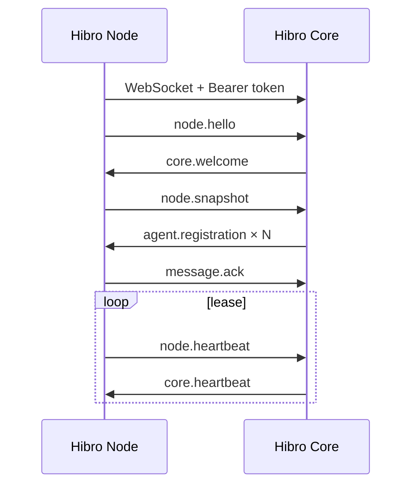
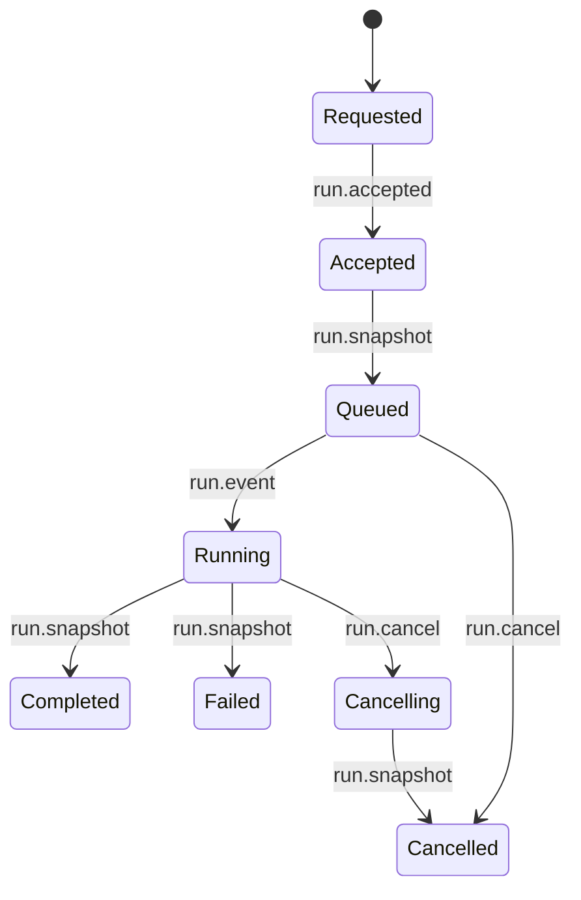

# Hibro Core ↔ Hibro Node Protocol v1

Status: Implementable specification  
Protocol identifier: `hibro.node.v1`  
Canonical transport: outbound secure WebSocket (`wss`)  
Large artifact transfer: object-storage presigned upload (v1)  
Encoding: UTF-8 JSON

## 1. Goals and boundaries

This protocol connects a Hibro Node to Hibro Core while keeping responsibilities clear:

- Core owns users, Teams, policy, cross-node routing, global scheduling and global artifact indexes.
- Node owns local Agent definitions, engine processes, workspaces, sessions, Runs, local events and local artifacts.
- A Node always opens the connection to Core. Core does not need inbound access to a home network.
- Every mutating command is idempotent and acknowledged.
- A Node can continue running in standalone mode while Core is unavailable.
- Reconnection resumes ordered delivery without silently losing Run events.

NATS can be used inside the Core deployment as an internal event bus. It is not the public
Node wire protocol in v1. WebSocket is the canonical edge transport because it works through
NAT, home routers and ordinary HTTPS reverse proxies without giving every Node NATS credentials.

## 2. Connection endpoint

```text
GET wss://<core-host>/v1/node-connect
Authorization: Bearer <node-token>
Sec-WebSocket-Protocol: hibro.node.v1
```

Requirements:

- TLS 1.2 or newer; TLS 1.3 preferred.
- Core must validate the Node token before accepting application messages.
- The token identifies one Core-side Node record and can be rotated independently.
- Core should reject frames larger than the negotiated `maxFrameBytes`.
- Default maximum frame size is 1 MiB.
- Artifact chunks must stay below the negotiated frame limit.

## 3. Envelope

Every application message uses this envelope:

```json
{
  "protocol": "hibro.node.v1",
  "messageId": "84e31a32-59ad-46ee-a4eb-6961ec5dc61e",
  "type": "run.create",
  "sentAt": "2026-07-25T08:00:00.000Z",
  "nodeId": "node_01...",
  "sequence": 42,
  "correlationId": "6f9c...",
  "causationId": "034d...",
  "idempotencyKey": "team-42-request-99",
  "requiresAck": true,
  "trace": {
    "traceId": "20af...",
    "spanId": "17e2..."
  },
  "payload": {}
}
```

Field rules:

| Field | Rule |
|---|---|
| `protocol` | Always `hibro.node.v1` |
| `messageId` | Globally unique UUID; never reused for a different payload |
| `type` | One of the registered v1 message types |
| `sentAt` | UTC ISO-8601 timestamp |
| `nodeId` | Required after `core.welcome` |
| `sequence` | Per-direction, per-Node monotonic positive integer |
| `correlationId` | Groups request, acknowledgement and resulting events |
| `causationId` | Message that directly caused this message |
| `idempotencyKey` | Required for mutating commands |
| `requiresAck` | Defaults to `false`; mutating commands and durable events use `true` |
| `payload` | Message-specific object |

Unknown optional envelope fields must be ignored. Unknown message types must produce
`message.error` with `invalid_message`.

## 4. Handshake and registration



### `node.hello`

The first application frame sent by Node. It includes:

- stable `nodeId`;
- process-unique `instanceId`;
- Node version, platform and architecture;
- installed engine capabilities and versions;
- supported protocol versions;
- optional resume token and last received sequences.

### `core.welcome`

Core selects the protocol and returns:

- `connectionId`;
- heartbeat interval and lease TTL;
- maximum frame size;
- new resume token;
- whether resume was accepted;
- the next expected sequence in each direction.

If resume is rejected, Node sends a full `node.snapshot` and replays all unacknowledged outbox
messages. Core deduplicates by `messageId` and `idempotencyKey`.

### `node.snapshot`

Contains the authoritative local Agent inventory, engine state and active Runs. A snapshot does
not delete Core history. Core marks missing Agents as no longer advertised by this Node and then
applies its own retention policy.

### `agent.registration`

Core responds for each Agent with:

- local `agentId`;
- `registered`, `rejected` or `error`;
- global `coreAgentId` when registered;
- accepted revision or structured error.

Node exposes this exact state to the local console and app API.

## 5. Heartbeat and presence

- Default heartbeat interval: 15 seconds.
- Default Node lease TTL: 45 seconds.
- Either side may send a heartbeat sooner when its state changes.
- Missing one heartbeat is not an outage.
- When the lease expires, Core marks the Node offline and stops assigning new Runs.
- Reconnection with a valid resume token can restore the same Node presence record.

Heartbeat includes active/queued Run counts, Agent count, resource pressure and the highest
sequence received from the peer.

## 6. Agent synchronization

Message types:

- `agent.upsert`: Core or Node proposes a complete Agent definition and revision.
- `agent.delete`: removes a Core-managed assignment; local history remains.
- `agent.registration`: registration result emitted by Core.

Conflict rules:

- Each Agent has a monotonically increasing `revision`.
- Core-managed fields and Node-local runtime fields are separate.
- A lower revision is acknowledged as `duplicate`.
- Same revision with a different payload is `conflict`.
- Core cannot directly set a filesystem path outside policy approved by Node.
- Team membership is never stored as an execution concern inside Node.

An Agent definition may contain an optional local `source`:

```json
{
  "source": { "type": "local", "path": "/workspace/project" }
}
```

This is only the Agent's default project. Its absence means the Agent starts in an empty,
private workspace; it does not make the Agent invalid or unavailable. Core stores this field as
opaque Node-local configuration and must not assume it can access the path.

## 7. Run lifecycle



### `run.create`

Core sends a durable, acknowledged command containing:

- `commandId`;
- requester identity and source;
- target local `agentId`;
- ordinary `CreateRunInput`, including an optional Run-level local `source`;
- optional deadline.

Core must set an `idempotencyKey`. Node stores the command before starting the engine. Repeated
delivery returns the original `run.accepted` payload.

A Run-level `source` overrides the Agent default for that Run. Node materializes it into an
ephemeral private workspace and removes that workspace after the Run. When neither the Run nor
the Agent defines a source, Node executes in the Agent's empty private workspace. A remote Core
may only send a local path that the Node operator has exposed and approved; v1 does not grant
Core arbitrary filesystem access.

### `run.accepted`

Node returns local `runId`, acceptance time and optional queue position. Acceptance means the
command is durably stored, not that the engine has started.

### `run.event`

Carries one ordered local Run event. Events keep their per-Run `sequence`; the envelope also has
the Node-to-Core connection sequence. Core deduplicates on `(nodeId, runId, event.sequence)`.

### `run.snapshot`

Carries the complete current Run record. Node sends snapshots:

- after acceptance;
- when execution starts;
- at every terminal state;
- after resume when Core asks for reconciliation.

### `run.cancel`

Cancellation is idempotent. Cancelling a terminal Run returns an accepted acknowledgement and
the existing terminal snapshot.

### `run.approval.decide`

Direct Runs, including Team steps, expose `engine.approval.requested` and
`engine.approval.resolved` in their ordered event stream. Core sends the Node-local Run ID,
provider `externalId` and one of `allow_once`, `allow_always`, `deny`. Node only accepts a
decision while the matching engine request is pending. This keeps Team workflows resumable
without requiring a synthetic user conversation.

## 8. Conversation lifecycle

Conversation is a first-class user-facing resource. Run remains an internal execution record for
one user turn.

Message types:

- `conversation.create`: Core asks the target Node to create a conversation bound to one local
  Agent.
- `conversation.message.create`: Core sends one user message with Core-generated user and
  assistant message IDs.
- `conversation.cancel`: Core asks Node to stop the active turn.
- `conversation.approval.decide`: Core returns an authenticated operator decision for one
  pending engine approval.
- `conversation.snapshot`: Node sends the complete conversation, messages and activities.
- `conversation.event`: Node sends one durable, ordered normalized event.

Node owns the engine session and authoritative activity normalization. Core owns authenticated
App access and a read model used for global browsing. A locally-created conversation is also
sent to Core after the Node connects.

`conversation.event` has a per-conversation sequence and one of:

- `conversation.created`, `conversation.updated`;
- `message.created`, `message.updated`;
- `activity.created`, `activity.updated`.

Activity types are `thinking`, `tool_call`, `tool_result`, `approval`, `progress` and `error`.
Only thought content actually emitted by an engine is included. Approval activity includes a
`resolvable` capability flag; Core must not offer a decision UI when the Node/provider bridge is
read-only.

For a resolvable approval, the activity contains the provider request ID and the allowed
decisions: `allow_once`, `allow_always`, `deny`. Core sends the activity ID and selected decision
back to the owning Node. Node must reject unknown, expired, duplicated or already-resolved
activities. Cancelling a Run resolves its pending approvals as `deny`.

Core→Node create/message commands use `idempotencyKey`. Node→Core snapshots and events use
`requiresAck` and the Node SQLite outbox. Core deduplicates conversation events on
`(conversationId, sequence)`.

## 9. Artifact transfer

Each artifact has a manifest containing preview kind, filename, relative path, content type,
logical encoding, byte size and SHA-256. File bytes do not travel in WebSocket frames.

1. Node sends `artifact.manifest` with `transfer.mode=object-storage`.
2. Core selects its configured storage provider and replies with
   `artifact.upload.authorized`. The payload contains a short-lived PUT URL and the exact headers
   that must be signed and sent.
3. Node streams the original bytes directly to that URL. The URL may target Core's local
   filesystem upload endpoint or a cloud object store such as Alibaba Cloud OSS.
4. Node sends `artifact.upload.complete` with final size and SHA-256.
5. Core verifies the stored object before changing the artifact from `uploading` to `available`.

Manifest and completion messages use `requiresAck` and the Node SQLite outbox. Reconnect sends a
complete manifest sync. Existing objects with the same stable artifact identity and SHA-256 are
not uploaded again. The legacy `artifact.upload` chunk message remains parseable during rolling
upgrades but new Nodes do not emit it.

Node persists a local synchronization state for every artifact:

- `local_only`: Core integration is disabled; the artifact remains fully usable on Node.
- `pending`: Core integration is enabled and the manifest is waiting to be delivered or accepted.
- `uploading`: upload authorization was received and the object upload/final acknowledgement is
  in progress.
- `synced`: the object upload completed and Core acknowledged `artifact.upload.complete`.
- `failed`: upload or permanent Core processing failed; the diagnostic error is retained.

`synced` therefore means both conditions are true: the object bytes reached the configured
storage provider and the Core catalog accepted the completion message. A successful HTTP PUT
alone must not set `synced`. Sync state is keyed by artifact identity, SHA-256 and Core URL so a
changed artifact or a different Core is sent again. When a standalone Node is registered later,
it first sends terminal Run snapshots and then manifests for all historical artifacts.

## 10. Acknowledgement, retry and outbox

Messages requiring acknowledgement are written to the local SQLite `core_outbox` before send.

`message.ack` status:

- `accepted`: persisted and accepted;
- `duplicate`: already persisted with the same identity;
- `rejected`: permanent validation or policy rejection.

For `artifact.manifest` and `artifact.upload.complete`, Core includes
`payload.artifact={artifactId,sha256,status:"available"}` when the exact object is already
available. This backward-compatible acknowledgement extension closes the historical-resync and
deduplication path without requiring an unnecessary second upload. Node may mark the artifact
`synced` only when this confirmation matches its current artifact identity and SHA-256.

Retry schedule:

```text
1s, 2s, 5s, 10s, 30s, 60s, then every 5 minutes
```

Add ±20% jitter. Respect `retryAfterMs`. Do not retry `rejected` unless configuration changes.
Outbox entries are retained for seven days after acknowledgement for diagnostics, then compacted.

## 11. Ordering and reconnection

- Sequence numbers are independent in Core→Node and Node→Core directions.
- A receiver accepts the next sequence, ignores exact duplicates and requests resync on gaps.
- Out-of-order frames are buffered only up to 128 messages or five seconds.
- A gap beyond that limit closes the connection with retryable `invalid_message`.
- The receiver persists its highest contiguous sequence before acknowledging it.
- Resume tokens are scoped to one Node identity and expire after seven days.

## 12. Backpressure

The WebSocket sender must stop reading new durable outbox work when:

- buffered outgoing bytes exceed 8 MiB;
- 256 acknowledgement-required messages are in flight;
- Core returns `capacity_exceeded`.

Run execution may continue locally. Events accumulate in SQLite and are replayed after pressure
falls. Core should pause new scheduling before forcing a Node to drop events.

## 13. Errors

`message.error` codes:

| Code | Retry |
|---|---|
| `authentication_failed` | No; rotate credentials |
| `unsupported_protocol` | No; negotiate another supported version |
| `invalid_message` | No for payload errors; reconnect for sequence gaps |
| `not_found` | No |
| `conflict` | Reconcile revision/idempotency state |
| `capacity_exceeded` | Yes, with backoff |
| `engine_unavailable` | Yes only after capability change |
| `permission_denied` | No |
| `internal_error` | Yes when `retryable=true` |

Errors must never include tokens, provider credentials, prompts marked secret, or raw environment
variables.

## 14. Security requirements

- Node tokens are stored as secrets and shown only by identifier.
- Tokens should be scoped to one Node and revocable.
- Core authorizes every command against Team, user and Node policy.
- Node independently validates local filesystem and sandbox policy.
- `danger-full-access` remains disabled unless both Core policy and Node settings allow it.
- Prompt and artifact content must be treated as untrusted data.
- Logs redact `Authorization`, signed URL query strings and provider keys.
- Clock skew greater than five minutes is reported, but sequence/idempotency still governs safety.

## 15. Compatibility

- Additive optional fields are backward compatible within v1.
- Removing fields, changing semantics or adding required fields requires `hibro.node.v2`.
- Core may support multiple protocol identifiers during rolling upgrades.
- Node advertises all supported versions and Core selects exactly one.
- Message type behavior is frozen once released.

## 16. v1 implementation phases

1. Handshake, registration, heartbeat and full snapshot.
2. Core-originated Run create/cancel and Node Run event/snapshot replay.
3. Artifact manifest, inline content and acknowledged chunk upload.
4. Agent configuration revision sync.
5. Optional NATS bridge inside Core; the Node wire contract remains unchanged.

The TypeScript envelope and payload definitions live in `src/core-protocol.ts`.
